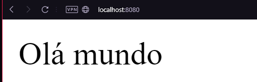

# Atividade 6 - Requisições HTTP

Como vimos na atividade 5, a realização de requisições HTTP acontecem a todo momento, tanto do lado do cliente, quanto do programador. Agora vamos mostrar como realizar requisições HTTP no nosso projeto em Node.JS.
Vamos utilizar como base, o nosso código que foi criado na atividade 4:

```javascript
const express = require('express')

const app = express()

const port = 8080

app.listen(port, () => {
    console.log('Servidor rodando na porta ' + port)
})
```
Segue o passo a passo para trabalhar com requisições HTTP:

## 1. CORS

A biblioteca CORS é uma ferramenta que permite que um site ou aplicação web possa interagir com recursos (como APIs ou dados) de outros sites, mesmo que esses sites estejam em domínios diferentes.

Para adicionar o CORS a nossa aplicação, basta abrir o terminal no nosso projeto e digitar a seguinte linha de comando:

```bash
npm install cors
```

Após fazer a instalação, vamos importar o módulo CORS após a importação do módulo Express, e guardar ele em um constante chamada "cors":

```javascript
const express = require('express')
const cors = require('cors')

const app = express()

const port = 8080

app.listen(port, () => {
    console.log('Servidor rodando na porta ' + port)
})
```

Após a declaração da constante "app", vamos adicionar a seguinte linha de código:

```javascript
app.use(cors())
```

Esta linha adiciona o middleware (é uma função que é executada entre a requisição HTTP, e a resposta do servidor. Ex: um middleware que verifica se um usuário está logado no sistema toda vez que for feita uma requisição) do CORS na aplicação Node.js. Essa linha permite que a aplicação aceite requisições de outros domínios, configurando os cabeçalhos HTTP necessários para que a requisição seja permitida. Em outras palavras, essa linha de código permite que a aplicação receba e envie dados para outras aplicações e domínios.

O seu código deve ficar parecido da seguinte maneira:

```javascript
const express = require('express')
const cors = require('cors')

const app = express()

app.use(cors())

const port = 8080

app.listen(port, () => {
    console.log('Servidor rodando na porta ' + port)
})
```

## 2. Criando nossa primeira rota

Rotas são caminhos que um usuário pode seguir dentro de uma aplicação web ou mobile para acessar diferentes páginas ou funcionalidades.

Por exemplo, imagine um site de comércio eletrônico que tenha uma rota para a página inicial, outra para a página de produtos, outra para a página de carrinho de compras e outra para a página de checkout. Cada uma dessas rotas representa uma parte da aplicação e é acessada por um endereço específico (geralmente definido na barra de endereços do navegador).

As rotas permitem que o usuário navegue pela aplicação de forma organizada e intuitiva, acessando apenas as partes que são relevantes para ele em cada momento.

Ex: http://google.com.br/maps

Todos conhecemos o site da Google, o motor de pesquisa mais famoso do mundo, O link acima nos direciona para o Google Maps. O `/maps` é uma das rotas do site da Google, onde ao acessá-la entramos no Google Maps.

Para gerenciar rotas em nossa aplicação, devemos criar um Router, que é a entidade responsável por gerenciar todas as rotas da nossa aplicação. Para isso, basta acrescentar a seguinte linha de código após o `app.use(cors)`:

```javascript
const router = express.Router()
```

Por padrão, quando acessamos qualquer site pelo navegador, toda informação visual que recebemos é retornada pelo método GET. Então vamos criar uma rota do tipo get na nossa aplicação utilizando o seguinte comando:

```javascript
router.get(
    '/',
    (req, res) => {
        const mensagem = 'Olá mundo';
        res.send(mensagem)
    }
)
```

A rota é definida através do método GET do objeto router, que recebe dois parâmetros:
A string '/', que define o caminho da rota como a raiz do servidor.
Uma função que recebe dois parâmetros, req e res, que representam a requisição e a resposta HTTP, respectivamente. Nesse caso, a função simplesmente envia a string "Olá mundo" como resposta usando o método send do objeto res.
Quando essa rota é acessada pelo navegador ou por outra aplicação cliente, o servidor responde com a string "Olá mundo".

E por fim, devemos indicar para a nossa aplicação que vamos utilizar as rotas definidas no nosso router:

```javascript
app.use(router)
```

O código final deverá ficar semelhante a esse:

```javascript
const express = require('express')
const cors = require('cors');

const app = express()

app.use(cors())

const router = express.Router();

router.get(
    '/',
    (req, res) => {
        const mensagem = 'Olá mundo';
        res.send(mensagem)
    }
)

app.use(router)

const port = 8080

app.listen(port, () => {
    console.log('Servidor rodando na porta ' + port)
})
```

Por fim, vamos testar se a nossa rota está funcionando, vamos rodar a aplicação usando o comando `node ./index.js`, onde `index.js` é o nome do seu arquivo, e vamos acessar o localhost pelo seu navegador e vamos ver a mensagem que nos é retornada, que deve ser a seguinte:



## 3. Atividade

Crie uma aplicação em Node.JS que utilize o Framework Express.JS e crie 3 rotas GET.

- `/nome` - Onde deverá ser retornado o seu nome
- `/idade` - Onde deverá ser retornada a sua idade
- `/hobbie` - Onde deverá ser retornado um hobbie seu