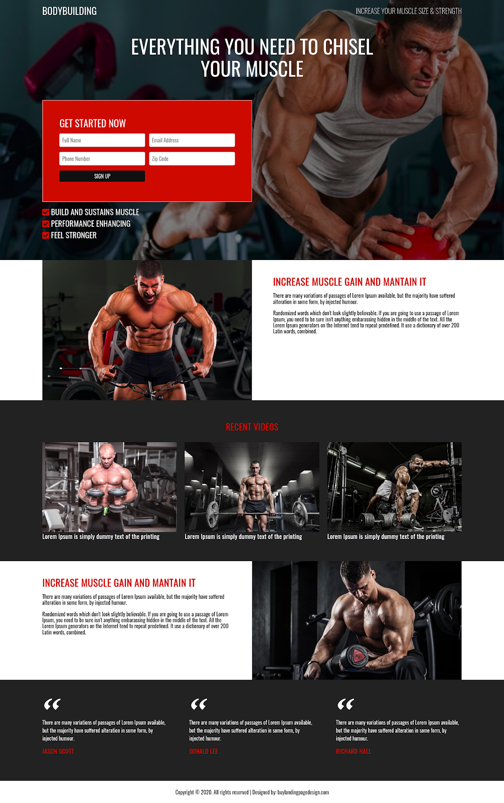

# Atividade 4 - Prática Flex Box

O intuito dessa atividade é consolidar a prática do desenvolvimento usando HTML e CSS (Flex box tb).

Então nessa semana eu vou apenas passar um template para vocês transformá-lo em uma página com os conhecimentos adquiridos nas últimas 3 atividades.

Os arquivos de referência para fazer o site estão no link abaixo:
https://drive.google.com/drive/folders/14nAxFYEYf8OZCftYCuZSDBhw7qVhrW1Z?usp=sharing

### Template da página

## Materiais complementares :3

Vou deixar aqui novamente a documentação da Mozilla sobre Flex Box pois acho que será útil:
https://developer.mozilla.org/pt-BR/docs/Web/CSS/CSS_Flexible_Box_Layout/Basic_Concepts_of_Flexbox
